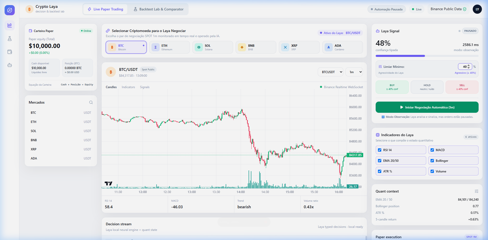
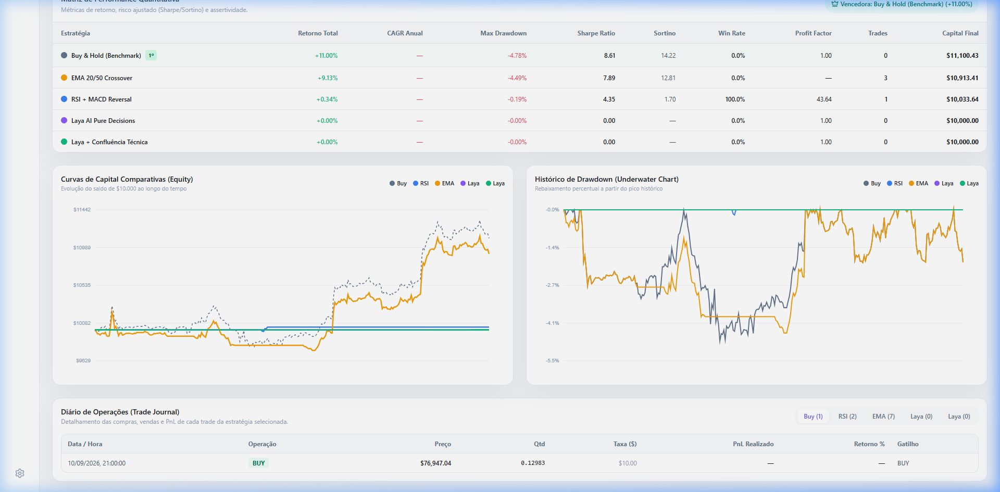
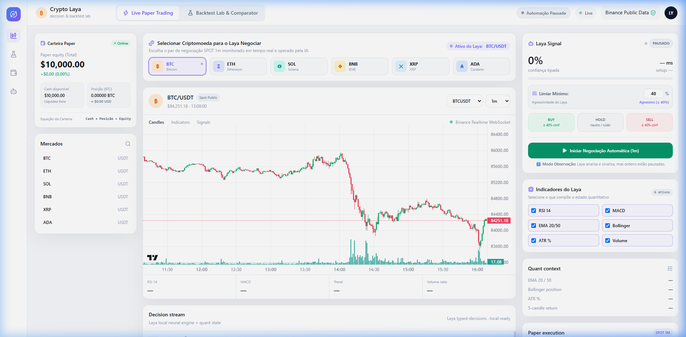

# 🪙 Crypto Laya Trader & Backtest Lab

<p align="center">
  
</p>

<p align="center">
  <strong>Simulador de Paper-Trading em Tempo Real e Laboratório de Backtest Comparativo com Inferência Neural Local do Laya</strong>
</p>

<p align="center">
  <a href="#-visão-geral"></a>
  <a href="#-visão-geral"></a>
  <a href="#-execução-com-docker"></a>
  <a href="#-fontes-de-dados-públicas"></a>
  <a href="LICENSE"></a>
</p>

---

## 📖 Visão Geral

O **Crypto Laya Trader** é uma aplicação monolítica em Python projetada para simulação de negociação financeira (*paper trading*) e pesquisa quantitativa de criptoativos em tempo real. O sistema integra:

1. **Terminal de Negociação Spot em Tempo Real (1m)**: Análise contínua a cada fechamento de candle de 1 minuto, alimentada por dados públicos da Binance via WebSocket.
2. **Motor Neural Laya Local (`convaiinnovations/laya`)**: Tomada de decisão tipada (`buy`, `sell` ou `hold`) com score de qualidade de setup e probabilidades operacionais calibradas.
3. **Laboratório de Backtesting & Comparador de Estratégias**: Simulação de dados históricos reais comparando estratégias clássicas (*Buy & Hold*, *RSI + MACD*, *EMA Crossover*) contra o *Laya AI*, com métricas de Sharpe, Sortino, Drawdown e curvas de capital multi-série.
4. **Zero Credenciais Necessárias**: Utiliza 100% a API pública Binance Vision (REST + WebSocket), dispensando criação de chaves de API ou cadastro em corretoras.

---

## 📸 Demonstração Visual

### 1. Terminal de Negociação ao Vivo & Feed de Decisões
Visão unificada com gráfico candlestick de alta performance (Lightweight Charts), seletor de criptoativos em tempo real, painel quantitativo e feed semântico de decisões.


### 2. Laboratório de Backtest Comparativo & Curvas de Capital
Simulação comparativa com matriz de performance quantitativa, indicação de estratégia vencedora e gráfico histórico de drawdown subaquático (*underwater*).



### 3. Painel do Laya Signal com Limiar de Confiança Editável
Controle dinâmico da agressividade do modelo (35% a 65%) com persistência imediata na API e legenda dinâmica dos gatilhos de compra e venda.



---

## ✨ Funcionalidades Principais

- **⚡ Live Paper Trading em 1 Minuto**:
  - Trava estrita de fechamento de candle com idempotência (sem execuções duplicadas no mesmo minuto).
  - Execução automática de ordens de compra (alocação de 25% do caixa) e venda (realização de 100% da custódia).
- **🛡️ Trava Start / Stop com Liquidação Automática**:
  - Botão interativo no terminal para ligar/pausar a automação.
  - Ao pausar, o robô **liquida imediatamente todas as posições abertas a mercado**, convertendo 100% dos recursos em cash e zerando o risco de exposição.
  - Modo Observação quando pausado: o Laya continua sinalizando no feed como `OBSERVAÇÃO`, sem movimentar capital financeiro e sem desenhar setas no gráfico.
- **🎚️ Limiar de Confiança Editável pelo Operador**:
  - Campo numérico na interface com ajuste percentual em tempo real (ex: 40%).
  - Chips informativos dinâmicos (`BUY ≥ X% conf` / `SELL ≥ X% conf`).
  - Classificação semântica precisa no feed: `MANTER LONG` (já em posição), `MANTER CASH` (sem custódia), `SINAL FRACO` (< limiar) e `EXECUÇÃO`.
- **🪙 Carteira Multi-Ativos**:
  - Suporte nativo e troca instantânea entre **BTC/USDT, ETH/USDT, SOL/USDT, BNB/USDT, XRP/USDT e ADA/USDT**.
  - Marcação a mercado contínua a cada tick de preço.
  - Equação estrita de balanço: $\text{Equity} = \text{Cash} + \text{Posição em USD}$.
- **🧪 Backtest Lab & Benchmark Comparativo**:
  - 5 estratégias integradas:
    1. *Buy & Hold (Benchmark)*
    2. *RSI + MACD Reversal*
    3. *EMA 20/50 Crossover*
    4. *Laya AI Pure*
    5. *Laya AI + Confluência Técnica*
  - Custos reais de mercado: taxa de corretagem Binance (0.1%) e slippage configurável.
  - Métricas completas: Retorno Total, CAGR, Max Drawdown, Sharpe Ratio, Sortino Ratio, Win Rate % e Profit Factor.
- **⚡ Cache Persistente em SQLite**:
  - Indexação determinística de estados de mercado por hash criptográfico (`sha256`), permitindo reexecutar backtests com latência zero (*cache hit* instantâneo).

---

## 🏗️ Arquitetura do Sistema

```text
                           Navegador Web (SPA)
             ┌──────────────────────┴──────────────────────┐
             ▼                                             ▼
     Chamadas REST (/api/*)                      WebSocket (/ws/live)
             │                                             │
             └──────────────────────┬──────────────────────┘
                                    │
                                    ▼
                         FastAPI Monolith Backend
             ┌──────────────────────┼──────────────────────┐
             ▼                      ▼                      ▼
    MarketDataService        PortfolioEngine        LayaDecisionEngine
    (Binance Vision API)   (Multi-Asset Paper)     (Local Typed Model)
             │                      │                      │
             │                      ▼                      ▼
             │                SQLite Database       laya_cache (Hash)
             │             (trades, decisions)
             ▼
    Binance Public Streams
    (REST + WebSockets)
```

---

## 🚀 Como Executar

### Pré-requisitos
- Python 3.10 ou superior (recomendado Python 3.12)
- Git
- Docker (opcional)

---

### Opção 1: Execução Local com Python

1. **Clone o repositório:**
```bash
git clone https://github.com/gugaucb/trade-simulator.git
cd trade-simulator
```

2. **Crie e ative o ambiente virtual:**
```bash
# Linux/macOS
python -m venv .venv
source .venv/bin/activate

# Windows (PowerShell)
python -m venv .venv
.venv\Scripts\Activate.ps1
```

3. **Instale as dependências:**
```bash
pip install -r requirements.txt
```

4. **Inicie o servidor de desenvolvimento:**
```bash
uvicorn app.main:app --host 127.0.0.1 --port 8000 --reload
```

5. **Acesse no navegador:**
Abra [http://127.0.0.1:8000](http://127.0.0.1:8000).

> **Dica:** Caso deseje rodar a interface sem carregar os pesos do Laya localmente, defina no arquivo `.env` ou nas variáveis de ambiente `LAYA_ENABLED=false`.

---

### Opção 2: Execução com Docker

1. **Construa a imagem Docker:**
```bash
docker build -t gugaucb/trade-simulator:latest .
```

2. **Execute o container:**
```bash
docker run -d -p 8000:8000 --name trade-simulator gugaucb/trade-simulator:latest
```

3. **Acesse a aplicação:**
Abra [http://localhost:8000](http://localhost:8000) no seu navegador.

---

## ⚙️ Variáveis de Ambiente

Crie um arquivo `.env` na raiz do projeto (baseado em `.env.example`):

| Variável | Padrão | Descrição |
| :--- | :--- | :--- |
| `DEFAULT_SYMBOL` | `BTCUSDT` | Par cripto inicial carregado no terminal |
| `DEFAULT_INTERVAL` | `1m` | Timeframe inicial do gráfico e decisões |
| `INITIAL_CASH` | `10000.0` | Saldo inicial em dólares para simulação paper |
| `LAYA_ENABLED` | `true` | Habilita/desabilita inferência neural local do Laya |
| `LAYA_MODEL` | `convaiinnovations/laya` | Identificador do modelo no HuggingFace |
| `DECISION_EVERY_CANDLES`| `1` | Frequência de geração de decisões em candles |

---

## 📡 Endpoints da API

### REST API
- `GET /api/bootstrap`: Carrega estado inicial completo (mercado, velas, ticker, carteira, trades, decisões e status do Laya).
- `GET /api/trading/status`: Retorna o estado atual da automação (`trading_active`), limiar de confiança e indicadores ativos.
- `POST /api/trading/toggle`: Inicia ou pausa a negociação automática (ao pausar, liquida 100% da custódia para cash).
- `POST /api/trading/config`: Atualiza dinamicamente símbolo, timeframe, indicadores ativos ou `confidence_threshold`.
- `POST /api/portfolio/order`: Executa ordens paper simuladas a mercado imediatas (teste manual de oscilação de saldo).
- `GET /api/backtest/strategies`: Lista o catálogo de estratégias quantitativas disponíveis no laboratório.
- `POST /api/backtest/run`: Executa a simulação comparativa histórica com streaming de progresso via WebSocket.

### WebSocket
- `WS /ws/live`: Stream bidirecional que transmite candles em tempo real, atualizações de carteira, execuções de ordens, decisões do Laya e progresso do backtest.

---

## 🧪 Testes Automatizados

O projeto conta com **40 testes unitários e de integração automatizados** cobrindo todas as camadas críticas:

```bash
# Executar a suíte completa de testes
pytest tests/ -v
```

Cobertura dos testes:
- **`tests/test_editable_confidence.py`**: Configuração dinâmica do limiar de confiança e classificação semântica de decisões.
- **`tests/test_stop_liquidation.py`**: Liquidação total compulsória para cash no Stop e dimensionamento estrito por saldo.
- **`tests/test_trading_lock.py`**: Trava de execução no modo observação e supressão de sinais falsos.
- **`tests/test_multi_asset_portfolio.py`**: Custódia multi-moeda e marcação a mercado.
- **`tests/test_backtest_engine.py` & `test_strategies.py`**: Motor de simulação, métricas quantitativas e estratégias.
- **`tests/test_laya_cache.py`**: Cache de inferência determinístico em SQLite.

---

## ⚠️ Isenção de Responsabilidade (Disclaimer)

Este projeto foi desenvolvido **exclusivamente para fins educacionais, acadêmicos e de pesquisa em finanças quantitativas e inteligência artificial**. 

- Não constitui recomendação de investimento, aconselhamento financeiro ou oferta de compra/venda de ativos.
- O mercado de criptomoedas apresenta alta volatilidade. Negociações reais envolvem risco significativo de perda de capital.
- Nunca utilize sistemas automatizados com capital real sem validação estatística rigorosa, testes fora da amostra (*out-of-sample*) e gerenciamento estrito de risco.

---

## 📄 Licença

Este projeto é distribuído sob os termos da licença **GNU General Public License v3.0 (GPL-3.0)**. Consulte o arquivo [LICENSE](LICENSE) para obter mais informações.
